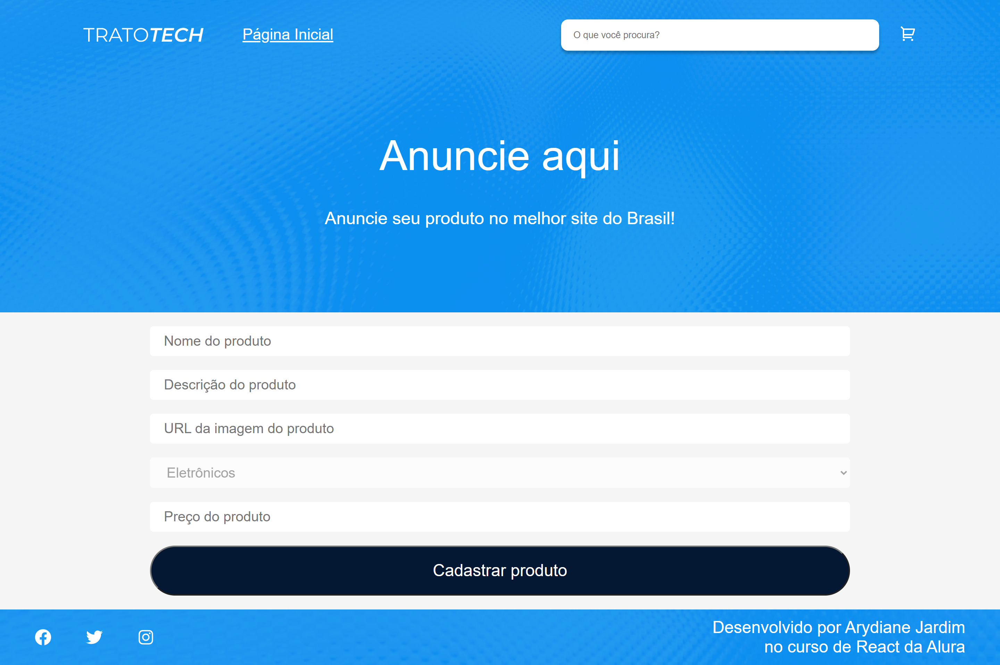

# Projeto Trato tech
O projeto Trato tech conseguimos adicionar itens de categorias no carrinho, filtrar, cadastrar, mudar a quantidade e favoritar itens. Foi desenvolvido durante os cursos "React: gerenciamo de estatos globais com Redux", "React: Mutabilidade x Imutabilidade no Redux Toolkit com Immer" e "React: entendendo Middlewares com Redux Thunk" da Alura.

O objetivo do projeto é praticar os seguintes conceitos:
 - Criar e gerenciar estados globais com Redux
 - Utilizar Redux Toolkit
 - Utilizar os hooks da biblioteca react-redux: useSelector, useDispatch
 - Criar um middleware
 - Utilizar o Redux Thunk
 - Utilizar actions de reducers

## 💻 Layout  

  
  
  

    
## 🔧 Tecnologias
As tecnologias usadas foram:
- React
- Redux Toolkit
- React router dom
- Sass
- CSS modules

## 🛠️ Abrir e rodar o projeto
Para abrir e rodar o projeto, execute yarn para instalar as dependências e yarn server yarn start para inicar o projeto.

Depois, acesse http://localhost:3000/ no seu navegador.
